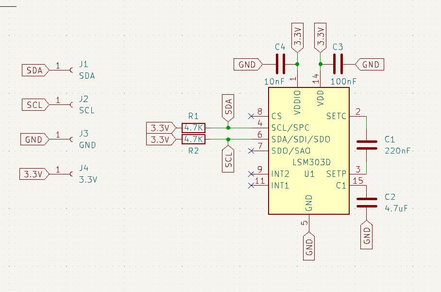
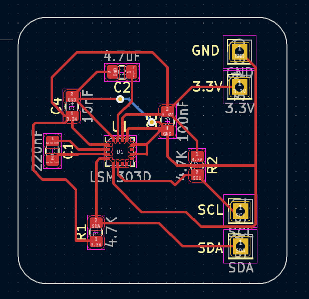

# LSM303D
LSM303D module

The LSM303D module is a small electronic sensor used to measure motion and magnetic fields. It combines two important sensors in one device: a three-axis accelerometer and a three-axis magnetometer. The accelerometer measures movement, tilt, and vibration along the X, Y, and Z axes. At the same time, the magnetometer measures the strength and direction of the Earth’s magnetic field. Because of this combination, the module can be used as a digital compass to determine orientation and direction.

The LSM303D module is often used in robotics, drones, navigation systems, and mobile devices. It communicates with microcontrollers through I2C or SPI communication protocols, which makes it easy to connect to platforms such as Arduino or Raspberry Pi. The module also has low power consumption, which makes it suitable for battery-powered projects and portable electronics.

Developers use the sensor data from the module to calculate heading, orientation, and motion. However, calibration is usually necessary to improve the accuracy of the magnetometer readings. With proper calibration and programming, the LSM303D can provide reliable and precise measurements. Because of its versatility and compact design, the LSM303D module is widely used in educational projects, embedded systems, and advanced motion-tracking applications.

## Scheme

## Board

## Sponsorship

This project is kindly sponsored by [PCBWay](https://pcbway.com).
PCBWay specializes in manufacturing high-quality PCBs and makes them affordable to hobbyist and professionals alike.

The range of services they offer include PCB prototyping, assembly, instant quotes for your order, a verification process by a team
of experts and an easy to use, hassle-free order process.

I'm grateful to PCBWay for the support in creating this project.
